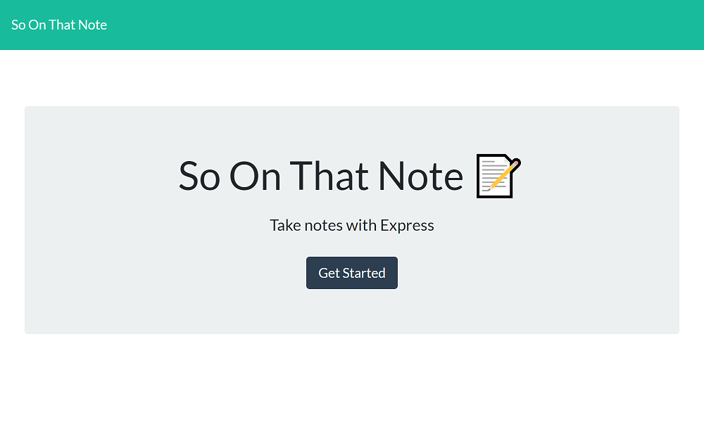

# So On That Note

## Description

So On That Note is a note taking application hosted on a server using Heroku. It uses express, mongoose, and dotenv, along with the MongoDB database.

## Table of Contents

- [Usage](#usage)
- [Contributing](#contributing)
- [Tests](#tests)
- [Questions](#questions)
  

## Usage

The best way to experience the full functionality of the application is to go to the Heroku address:

[Hosted Heroku Version](https://mysterious-woodland-45975.herokuapp.com/)

## Contributing

This app is not taking contributions at this time.

## Tests

If you want to test functionality, go to Heroku and try adding and deleting notes.

## Questions

If you wish to view more of my work, feel free to visit my GitHub account. Additionally, if you have any questions, you can contact me at the email address below. Thanks!

[GitHub](https://github.com/SpencerHulse)

<hulse.spencer@gmail.com>
